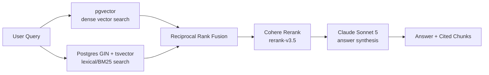

# Enterprise RAG — MCP Server Cookbook

A developer starter kit for wiring this repo's Retrieval-Augmented Generation
pipeline into Claude Code, Claude Desktop, or any other MCP-compatible client.

## Architecture



1. **Retrieve** — the query is embedded (OpenAI `text-embedding-3-small`) and run against `document_chunks.embedding` (pgvector) in parallel with a Postgres full-text search over the `fts_tokens` GIN index (see `migrations/001_add_fts_tokens.sql`).
2. **Fuse** — both result sets are combined with Reciprocal Rank Fusion (RRF).
3. **Rerank** — the fused candidate pool is reranked by Cohere (`rerank-v3.5`) for relevance.
4. **Synthesize** — the top-`k` reranked chunks are passed to Claude Sonnet 5 with a system prompt that restricts it to the provided context and requires inline chunk citations.

This pipeline is exposed two ways:

- **HTTP** — `POST /documents/search` and `POST /documents/answer` (FastAPI, `app/router.py`).
- **MCP** — `search_raw_chunks` and `query_enterprise_rag` tools (`mcp_server.py`), which call the exact same underlying functions (`_hybrid_search_and_rerank`, `_synthesize_answer`) directly — no HTTP hop, no drift between the two surfaces.

## MCP Tools

| Tool | Args | Returns |
|---|---|---|
| `query_enterprise_rag` | `query: str`, `top_k: int = 3` | `{query, answer, retrieved_context, model_used}` |
| `search_raw_chunks` | `query: str` | List of reranked chunks (`id`, `title`, `content`, `chunk_index`, `rrf_score`, `rerank_score`) |

## Registering the Server

### Claude Code

Claude Code auto-discovers project-scoped MCP servers from a file named
**`.mcp.json`** at the repo root. This repo ships `.mcp_config.json` with the
same contents — either rename/copy it to `.mcp.json`, or register it directly
with the CLI:

```bash
claude mcp add enterprise-rag -- python mcp_server.py
```

Verify it's registered:

```bash
claude mcp list
```

`.mcp_config.json` contents:

```json
{
  "mcpServers": {
    "enterprise-rag": {
      "command": "python",
      "args": ["mcp_server.py"],
      "env": {}
    }
  }
}
```

> Make sure `python` on `PATH` resolves to the project's virtualenv (activate
> `venv` first), or replace `"command"` with the absolute path to
> `venv/Scripts/python.exe` (Windows) / `venv/bin/python` (macOS/Linux), and
> ensure `DATABASE_URL`, `OPENAI_API_KEY`, `ANTHROPIC_API_KEY`, and
> `COHERE_API_KEY` are available in the server's environment (via `.env` or
> the config's `"env"` block).

### Claude Desktop

Add the same block to Claude Desktop's config file
(`claude_desktop_config.json` — under `%APPDATA%\Claude\` on Windows or
`~/Library/Application Support/Claude/` on macOS), then restart Claude
Desktop.

## Example: Invoking a Tool from Python

```python
import asyncio
from mcp import ClientSession, StdioServerParameters
from mcp.client.stdio import stdio_client

server_params = StdioServerParameters(
    command="python",
    args=["mcp_server.py"],
)

async def main():
    async with stdio_client(server_params) as (read, write):
        async with ClientSession(read, write) as session:
            await session.initialize()

            result = await session.call_tool(
                "query_enterprise_rag",
                arguments={"query": "What was Q2 revenue growth?", "top_k": 3},
            )
            print(result.content[0].text)

asyncio.run(main())
```

## Local Development

```bash
pip install -r requirements.txt
python mcp_server.py          # runs over stdio for local MCP clients
# or
uvicorn app.main:app --reload # runs the FastAPI HTTP surface
```

Both entry points share the same `document_chunks` table, connection pool
(`app/database.py`), and pipeline code (`app/router.py`) — there is exactly
one implementation of hybrid search and answer synthesis in this repo.
