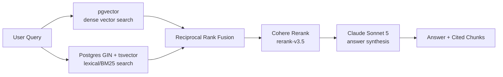

# Enterprise RAG — MCP Server Cookbook

A developer starter kit for wiring this repo's Retrieval-Augmented Generation
pipeline into Claude Code, Claude Desktop, or any other MCP-compatible client.

## Architecture



1. **Retrieve** — the query is embedded (OpenAI `text-embedding-3-small`) and run against `document_chunks.embedding` (pgvector) in parallel with a Postgres full-text search over the `fts_tokens` GIN index (see `migrations/001_add_fts_tokens.sql`).
2. **Fuse** — both result sets are combined with Reciprocal Rank Fusion (RRF).
3. **Rerank** — the fused candidate pool is reranked by Cohere (`rerank-v3.5`) for relevance.
4. **Synthesize** — the top-`k` reranked chunks are passed to Claude Sonnet 5 with a system prompt that restricts it to the provided context and requires inline chunk citations.

This pipeline is exposed two ways:

- **HTTP** — `POST /documents/search` and `POST /documents/answer` (FastAPI, `app/router.py`).
- **MCP** — `search_raw_chunks` and `query_enterprise_rag` tools (`mcp_server.py`), which call the exact same underlying functions (`_hybrid_search_and_rerank`, `_synthesize_answer`) directly — no HTTP hop, no drift between the two surfaces.

## MCP Tools

| Tool | Args | Returns |
|---|---|---|
| `query_enterprise_rag` | `query: str`, `top_k: int = 3` | `{query, answer, retrieved_context, model_used}` |
| `search_raw_chunks` | `query: str` | List of reranked chunks (`id`, `title`, `content`, `chunk_index`, `rrf_score`, `rerank_score`) |

## Registering the Server

The server runs over **Streamable HTTP**, not stdio. On Windows, the stdio
transport in the `mcp` Python SDK reliably hangs the moment a tool makes an
outbound async HTTP call (OpenAI/Cohere/Anthropic) — reproducible independent
of event-loop policy, DB access, or client construction timing, and matches a
known, long-standing category of unresolved Windows stdio issues in the SDK's
own tracker (e.g. GH #2832, #2653). Streamable HTTP runs on the same async
stack this repo's FastAPI app already uses reliably, and does not hang.

**Start the server first** (it must already be running — HTTP transport isn't
spawned on demand by the client the way stdio is):

```bash
python mcp_server.py
# INFO:     Uvicorn running on http://127.0.0.1:8765 (Press CTRL+C to quit)
```

### Claude Code

Claude Code auto-discovers project-scoped MCP servers from a file named
**`.mcp.json`** at the repo root. This repo ships `.mcp_config.json` with the
same contents — either rename/copy it to `.mcp.json`, or register it directly
with the CLI:

```bash
claude mcp add --transport http enterprise-rag http://127.0.0.1:8765/mcp
```

Verify it's registered:

```bash
claude mcp list
```

`.mcp_config.json` contents:

```json
{
  "mcpServers": {
    "enterprise-rag": {
      "type": "http",
      "url": "http://127.0.0.1:8765/mcp"
    }
  }
}
```

> Port 8765 is chosen to avoid colliding with the FastAPI app, which defaults
> to `:8000` under `uvicorn`. Both can run at the same time.

### Claude Desktop

Add the same `mcpServers` block to Claude Desktop's config file
(`claude_desktop_config.json` — under `%APPDATA%\Claude\` on Windows or
`~/Library/Application Support/Claude/` on macOS), with `mcp_server.py`
already running, then restart Claude Desktop.

## Example: Invoking a Tool from Python

Requires `mcp_server.py` to already be running (see above).

```python
import asyncio
from mcp import ClientSession
from mcp.client.streamable_http import streamablehttp_client

async def main():
    async with streamablehttp_client("http://127.0.0.1:8765/mcp") as (read, write, _):
        async with ClientSession(read, write) as session:
            await session.initialize()

            result = await session.call_tool(
                "query_enterprise_rag",
                arguments={"query": "What was Q2 revenue growth?", "top_k": 3},
            )
            print(result.content[0].text)

asyncio.run(main())
```

## Local Development

```bash
pip install -r requirements.txt
python mcp_server.py          # runs the MCP server on http://127.0.0.1:8765/mcp
# or, separately
uvicorn app.main:app --reload # runs the FastAPI HTTP surface on :8000
```

Both entry points share the same `document_chunks` table, connection pool
(`app/database.py`), and pipeline code (`app/router.py`) — there is exactly
one implementation of hybrid search and answer synthesis in this repo.
